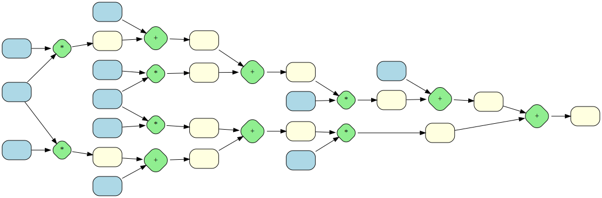

Allows building a computation graph:

```rust
let mut ops = Operations::default();
let [a, x, b, y] = ops.vars();
let y_pred = ops.insert(a * x + b);
let _loss = ops.insert((y - y_pred).pow_2());
```

You can run compute the values for all the nodes in the graph with `Operations::forward` and the gradients of each node with respect to some target node with `Operations::backward`.

`main.rs` currently implements visualizing the graph through dotviz:

```
cargo run | dot -Tsvg -o graph.svg
```


