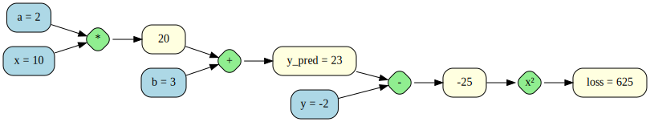
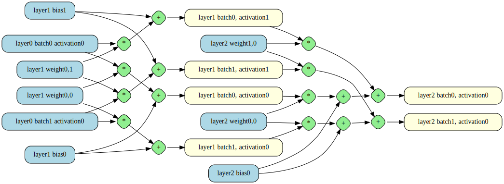

This library implements automatic differentiation which involves building a
computation graph, performing a forward pass to compute outputs and a backward
pass to compute gradients with respect to some expression.

```rust
let mut ops = Operations::default();
let [a, x, b, y] = ops.vars();
let y_pred = ops.insert(a * x + b);
let loss = ops.insert((y - y_pred).pow_2());

// Allocate space to store values and gradients.
let mut values = Values::new(ops.len());
let mut gradients = Gradients::new(ops.len());

// "Randomly" initialize weights.
values[a] = 0.5;
values[b] = -0.5;

// Forward pass
values[x] = 4.0; // one of our training inputs.
values[y] = 2.0 * values[x] + 3.0; // we'll model f(x) = 2x + 3
ops.forward(&mut values);

// Backward pass.
ops.backward(&values, &mut gradients, loss, 1.0);

// Adjust weights based on gradient and learning rate.
values[a] -= gradients[a] * 0.001;
values[b] -= gradients[b] * 0.001;
```

## Visualization

The computational graph can be visualized with graphviz. It works well for small
graphs but for larger graphs things quickly become difficult to interpret. This
is mostly due to how we don't support n-ary operators and so large sums are a
combination of many addition operations. It is partially due to bad automatic
node placement which could be improved by providing placement information.

```
cargo run --example simple | dot -Tsvg -o simple.svg
```



```
cargo run --example layers | dot -Tsvg -o layers.svg
```


